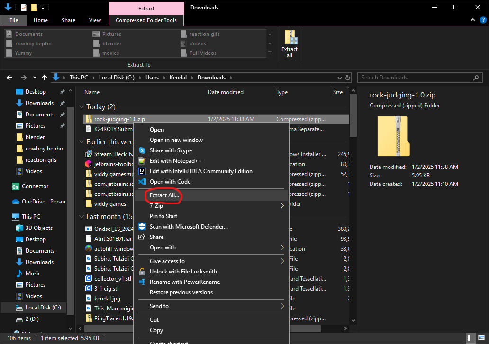
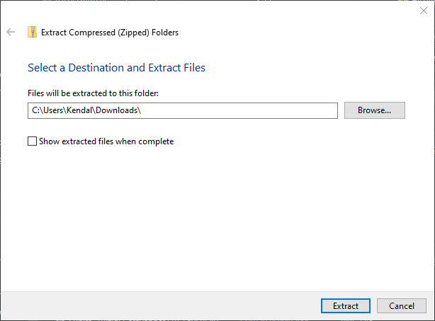
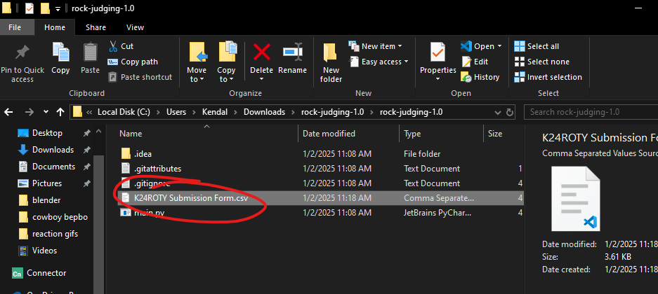
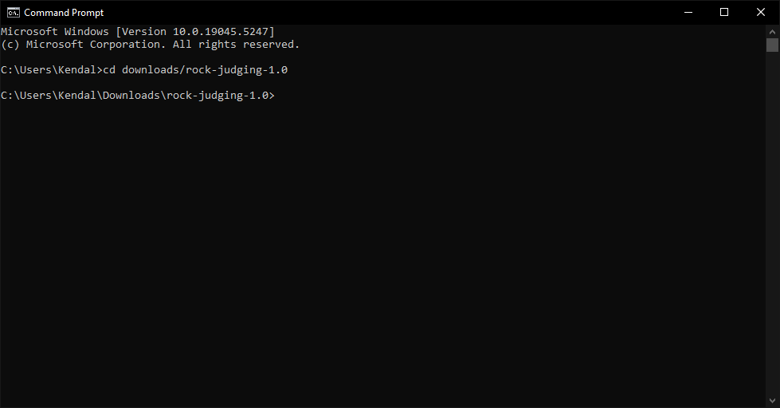
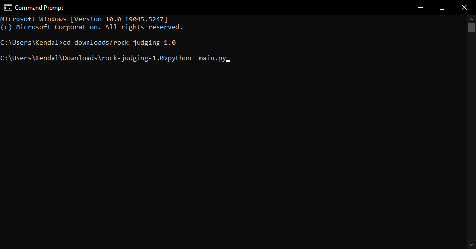

# Extract from zip

right-click on the zipped file and select "extract all"

make sure to extract to *downloads only* to ensure the command line stuff works 

# running the program

take the provided *.csv file and drop it in the directory

press the windows key, type `cmd`, and in the command prompt type `cd downloads/rock-judging-1.x` (replace the x with the version you are using)

run the command `python3 main.py`

this should download the images and allow you to judge the rocks :)